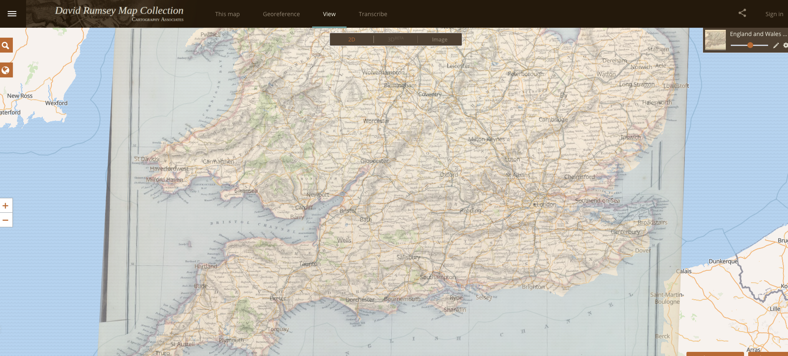
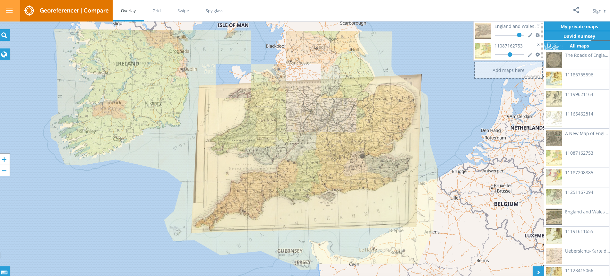

# Text Analysis with Voyant

Voyant 
Voyant-tools.org is a collection of text mining tools with a user interface. It's a great way in to text mining. 

## Loading a text

Open a browser and go to https://voyant-tools.org/

### Load a pre-existing text  

The front page of Voyant allows you to add texts, either one or multiple. It also has a limited selection of texts pre-loaded, so if you would prefer to load one of these and just spend some time playing around with the interface, that is a good place to start. Click 'Open' and choose a corpus containing the entire works of either William Shakespeare or Jane Austen. If you do this, you can skip straight to the 'Voyant Interface' section below, if you like.

### Loading your own text

There are two ways to load your own text(s): either by entering a url to a document or by uploading a file from your own computer. We'll use plain text files (the type created by notepad or TextEdit), but you can also upload HTML, XML, and various others (see the [help file](https://voyant-tools.org/docs/#!/guide/corpuscreator-section-input-format) for more details).

First we need some books in plain text format. [Project Gutenberg](https://www.gutenberg.org/) is a site containing a large database of freely-available ebooks, in a variety of formats. Let's make a corpus containing the four Sherlock Holmes novels. 

First, open a new tab in your browser, and find the book you'd like to add on the site, using the search or browse function. The book page will allow you to download the eBook in a number of formats. Once you've found a book of interest, right click on the 'Plain Text UTF-8' link, and click 'copy the link address' (in Chrome):

Return to the Voyant-tools tab, and paste the link into the input box. Switch back to Project Gutenberg and find the other three novels and repeat the process. Copy over the links and put one on each line:

Click 'Reveal' to load the texts in Voyant.

If you're not interested in literature, or if you have a set of documents from your own research you'd like to analyse, you can add text from any URL, or from your computer. There are many sources of text files available, although in many cases, you'll have to first download and unzip a set of files before uploading them. 

Some to try include (however many of these are large files or require some additional steps, and might be best to try offline after the workshop):

[The Oxford Text Archive](https://ota.bodleian.ox.ac.uk/)

Follow the instructions here: https://glam-workbench.net/trove-harvester/ to bulk download text files from Australian historical newspapers.

The Enron corpus (https://www.cs.cmu.edu/~enron/) if you are interested in more recent text for analysis.

## Voyant Interface  

Whether you loaded a pre-existing text, or added your own, you should now be presented with the following screen:

There's a lot going on here at first, so I'll break it down. The screen is divided into five separate panes: three at the top and two underneath, displaying a range of standard text mining tools. Voyant has many more tools available, and you can swap out the default ones for others. If you hover over the top-right of a pane, you'll see three new options. If you click on the windows icon (second from the left), you can select a new tool to replace the current one. You can do this for any of the windows. 

The default tools are, clockwise from the top-left: 

* A word cloud (and list of top terms). A word cloud displays the most frequent words in a corpus, sized by the number of occurences. It's a good way to get an overview of a particular text.
* A reader with the full texts. 
* A trends tool, displaying the frequency of either the five most-common words or a selected word.
* A 'collocation' tool (displays a set number of words either side of a selected word)
* A summary of the corpus. 

Some of the windows have additional pages. Click on 'terms' in the word-cloud (top-left) and instead of a wordcloud you'll get a count of the occurences of the top terms. 

The windows are connected to each other: for example, if you click on a word in the word cloud in the top-left window, you'll see the frequency of that word in the trends pane on the right. 

One typical text mining question is to use what's known as the 'type-token ratio' to compare the writing style of a set of documents. It's the total number of *unique* words (known as types) divided  by the total number of words (tokens). The ratio of the two can be interpreted as the 'richness' of the vocabulary in a particular text.  

To see this, click on the documents tab in the summary window (bottom-left by default)

We can see that there is some difference between the Sherlock Holmes novels (though we need to be careful with the interpretation: longer novels will naturally have a smaller ratio: it would be surprising if an author's use of unique words continued to increase as they wrote longer novels. The two final novels are a very similar length and most easily comparable, and they have very similar ratios).

Spend some more time trying out Voyant tools. Swap out the default windows for some other ones, and note any interesting observations.

# Text analysis with a coding language

If you'd like to get a flavour of how you can use a programming language can be used to analyse text, you have a couple of options. I've put together a very short demo of R in an interactive document called a 'notebook', here. 

This notebook loads in an interactive environment called Binder. Once the link above has loaded, you'll see an interactive document with instructions. 

A third option is to use a service called Constellate, run by the Journal database Jstor. This allows you to build and analyse a corpus of JStor articles, using search terms. They take some time to initialise, so for now it's best to use an existing one. 

First, go to https://constellate.org/ and click on 'dashboard' on the top-right. You have the option of building a new dataset or selecting a featured dataset. For now, try out one of the featured datasets. Click 'analyze', and you'll get a pop-up window containing links to a series of notebooks—interactive documents containing code and text. If you have never used Jupyter notebooks before, start with the first tutorial to learn how to use them - otherwise feel free to check out other ones more specific to text mining. 

After this workshop, I can recommend playing around with the corpus builder, which will construct a dataset suitable for text mining from a set of parameters and keywords.

# Section 2: Mapping

As with the above, here are three things to try out using maps, in order of difficulty. 

## 1 - Find a map on David Rumsey

Spatial Humanities isn't just about creating your own maps, but finding and (eventually) analysing existing, often historical ones. The site https://www.davidrumsey.com/ contains 1000s of historical maps which have mostly been 'geo-rectified', meaning that they have been fixed to modern coordinates. This means you can overlay over a modern map to look for changes over time. 

We'll use the 'MapRankSearch' feature to find a map of interest. Open https://rumsey.mapranksearch.com/ in a browser

As you scroll and zoom the map, search results on the right-hand side will reflect the area shown. You can also restrict the map dates using the slider underneath. Once you've found a map, click on it to open it in a picture viewer. Next, click 'View in Georeferencer' to open the map overlaid on a modern one. Use the slider at the top-right of this screen to turn the transparency of the old map up or down, revealing the modern map beneath.

To go even further, you can compare multiple maps at once. CLick the 'overlay and compare' button in the bottom-right corner, which will open the map in Georeferencer.com: here you can add more maps to the interface and change the transparency of each one.

Questions:

## 2 - Plot some points in Palladio

Many tasks using maps involve displaying some geographic data. To do this we can use a tool called Palladio, which was specifically made to work with humanities data. There are a number of very good tutorials for using Palladio, particularly https://miriamposner.com/blog/getting-started-with-palladio/ but in this short session we'll use the sample data to have a look around.

First, go to http://hdlab.stanford.edu/palladio/ and click 'start'. This is where you can load your own data in .csv format (follow the tutorial above to learn how to structure it), or else click on the 'Try with sample data' link on the left hand side.

The project view of Palladio will load up. The sample data is a small dataset of notable individuals, with their gender and places and dates of birth and death. Let's map all the birthplaces in the dataset. 

Click on the map tab at the top of the screen:

Next, create a 'layer', which will allow us to draw points of data on top of the map. Click 'new layer' and give it a name. 

Next, tell Palladio which data to use to draw points on the map. Click on the 'Places' box which will give a drop-down of all the fields in the data with geographic coordinates. Click on the first one, 'Birthplace'.

Last, we want to size the points by the number of people born in that place. Click on the size points tickbox, which will give you a couple of options for data to use for sizing. Leave it at the default, 'Number of People':

Click 'Add layer' to create the points on your map. You've just created a basic interactive map, congratulations! You can move the map around by clicking and dragging, and hovering over a point will display the relevant data (in this case, the number of people born in that place)

Some other things to try:

Add another layer (place of death) and compare the two. 

Try out the 'point to point' option, using both place of birth and place of death.
3 - Use R to create a map

# Network Analysis

Step 1: Load network data into Palladio

Step 2: Load network data into Network Navigator

Step 3: R library with Network Analysis (or maybe Jupyter/Google collab)