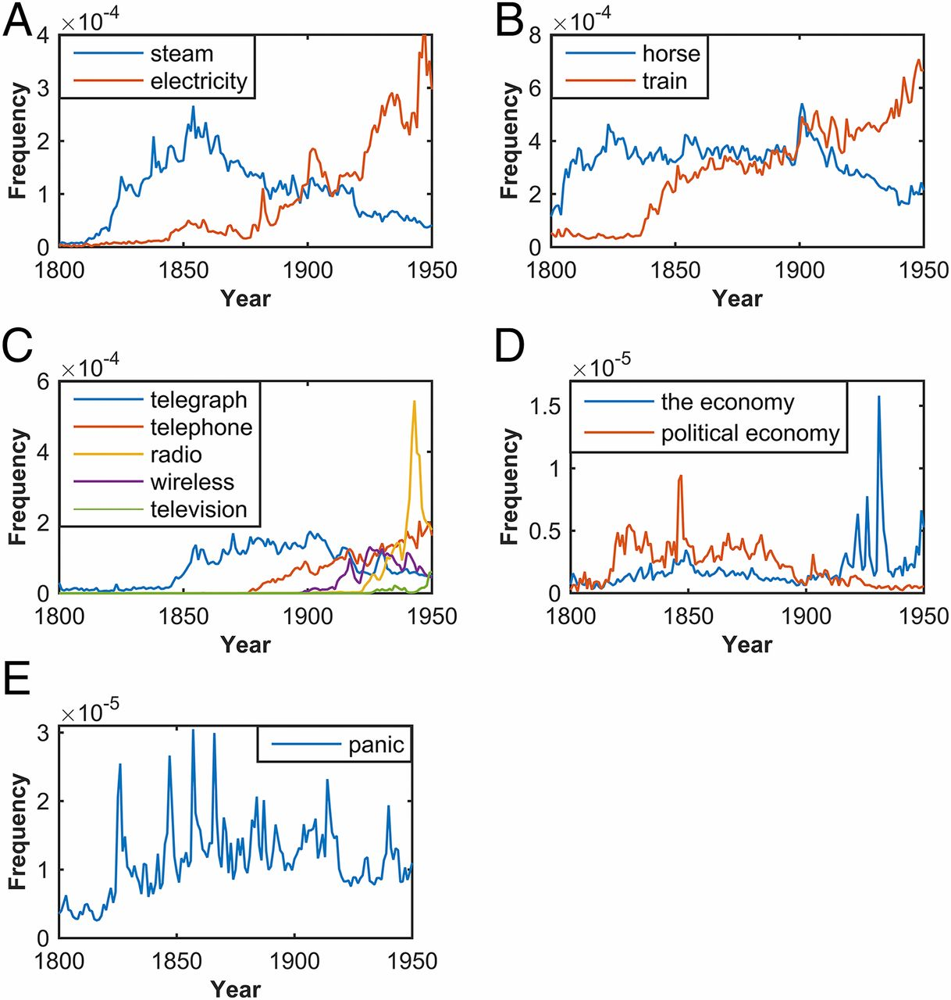
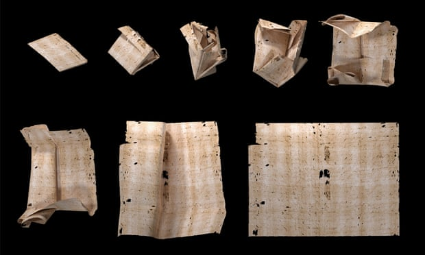
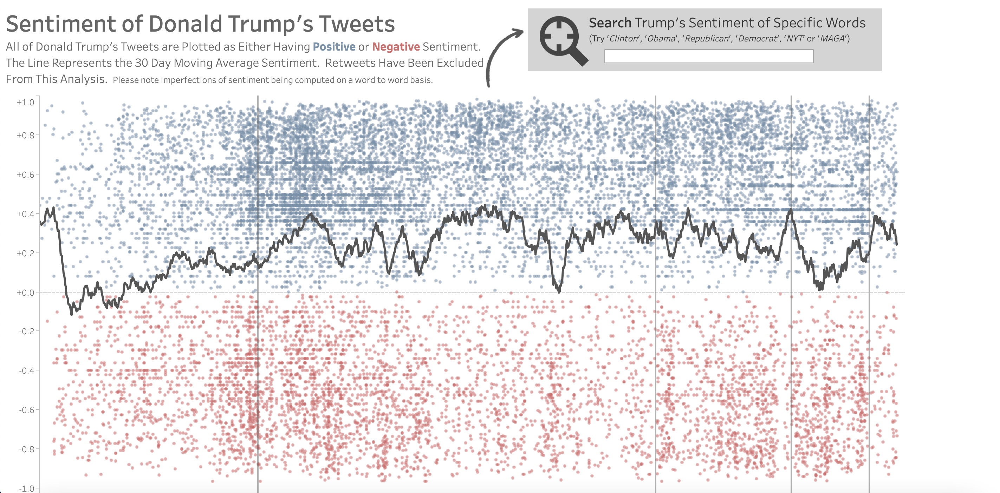
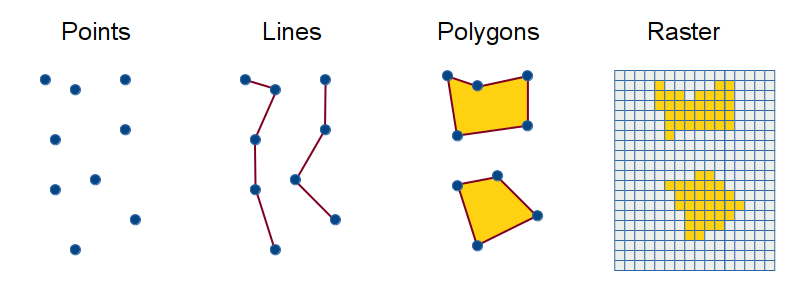
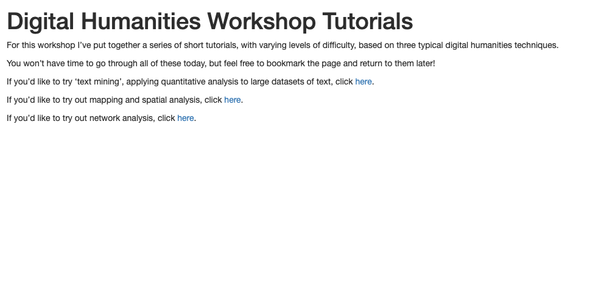
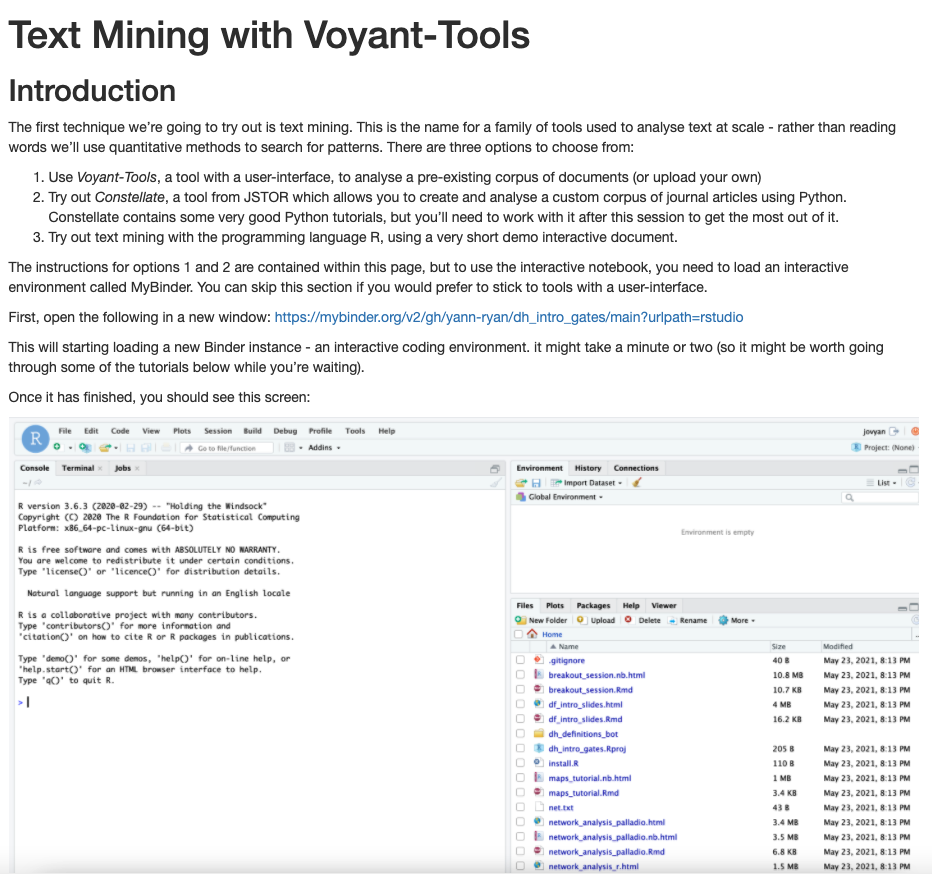

```{r setup, include=FALSE}
knitr::opts_chunk$set(echo = FALSE)
```

## Workshop plan:

-   Start by trying to define Digital Humanities (DH)

-   We'll look at DH from the perspectives of data and analysis

-   We'll take a look at three of the most common toolsets used for
    digital humanities:

    -   Text mining
    -   Network analysis
    -   Mapping

-   I'll run through the key principles behind each one and give advice
    on tools and methods

-   Following this will be a self-guided tutorial based on a method of your choice. Feel free to ask questions or work with other participants!

-   Slides are available on yann-ryan.github.io/dh_intro_slides

# What are the Digital Humanities?

## What are the Digital Humanities?

A discipline which emerged from 'humanities computing', applying
computing techniques to humanities subjects. The term 'Digital humanities' reflects
a change in focus: it is about using digital methods to ask old
questions in new ways, but also about applying humanities thinking and
skills to digital methods.

From Wikipedia: The digital humanities, also known as humanities
computing, is a field of study, research, teaching, and invention
concerned with the intersection of computing and the disciplines of the
humanities. It is methodological by nature and interdisciplinary in
scope. It involves investigation, analysis, synthesis and presentation
of information in electronic form. *It studies how these media affect
the disciplines in which they are used, and what these disciplines have
to contribute to our knowledge of computing.*

## What are the Digital Humanities?\|As many definitions as there are DH practitioners! twitter.com/dhdefined


## What are the Digital Humanities?


## What are the Digital Humanities?


## What are the Digital Humanities?


# Digital Humanities Disciplines

## Computational Literary Studies

-   'Text mining' works of literature to find patterns within individual
    texts or changes in genres or authors over time
-   For example this paper looking at the changes in readability scores
    in the Harry Potter series, and what this says about the age of the
    implied readership

{width="500"}

## Computational Literary Studies

-   In this paper, the authors analysed 120,000 Goodreads user reviews
    and used an algorithm to detect topics and how often they appeared
    in reviews of certain 'classic' works.
    (<https://doi.org/10.22148/001c.22221>)

{height="400"}

## Digital History

Applying statistics or other quantitative methods to the study of the
past:

-   Looking at text: this paper which analysed 150 years of British
    newspapers looking for changing patterns

{width="362"}

## Digital History

-   Looking at other types of data, such as census records or port
    books:

{width="600"}

## Digital History

-   Using X-Ray scanning to read unopened letters -
    <http://letterlocking.org/>



## Many other areas

-   Archaeology
-   Gaming
-   Digital resources are also considered digital humanities:
-   Creating a digital 'edition' or a web resource for others to use.
-   Digital exhibitions and virtual worlds

# To do DH you need DATA

## Types of datasets|

-   Full-text datasets
-   Metadata datasets
-   Image datasets

## Text datasets

-   A *corpus* is a collection of single *texts* or *documents.*

-   Documents could be a book, a newspaper article, or a poem

-   Range of *corpora* online

    -   Project Gutenberg (<https://www.gutenberg.org/>) contains
        thousands of free full-text out of copyright books
    -   Google N-gram datasets
        (<https://storage.googleapis.com/books/ngrams/books/datasetsv3.html>)
    -   Hathi trust datasets (<https://www.hathitrust.org/datasets>
    -   Library of Congress Newspapers - 'Chronicling America'
        (<https://chroniclingamerica.loc.gov/>)
    -   British Library: <https://data.bl.uk/bl_labs_datasets/>
    -   National Library of Australia's Trove:
        (<https://trove.nla.gov.au/>)
    -   KB Netherlands Labs: <https://lab.kb.nl/datasets>
    -   Constellate

## Metadata datasets

-   Early Modern Letters Online - <http://emlo.bodleian.ox.ac.uk/home>
-   Old Bailey Online (17-19th century prison records) -
    <https://www.oldbaileyonline.org/>
-   Electronic Englightenment Project
-   London Lives Coroners' Inquests -
    <https://github.com/sharonhoward/ll-coroners>

## Image datasets

-   KB labs datasets <https://lab.kb.nl/datasets>
-   ImageNet <https://www.image-net.org/>
-   British Library Flickr:
    <https://www.flickr.com/photos/britishlibrary>

## Creating your own

-   You can use a simple excel spreadsheet, and there is also software
    available to collect and record your own data:
-   Zotero (<https://www.zotero.org/>)
-   Recogito (<https://recogito.pelagios.org/>)

## Creating your own dataset: what to think about:

-   What type of data is it? Is it structured or unstructured?
-   What is the purpose?
-   Who is the intended audience?
-   Where is it going to live, particularly after the end of your
    project?
-   What would other researchers need to know to use it?
-   Are there copyright or ethics issues?

## Breakout Session 1 (10 minutes)

-   In small groups, discuss: do you consider your research 'data'?
-   What would you need to do to turn your data into something you could
    use with DH? Think about:
-   Is it structured or unstructured?
-   Are there ethical or copyright concerns?
-   How would you use it?

## Data cleaning

-   Humanities datasets are often 'messy': spelling variations,
    transcription errors, input errors can have serious effects on
    resulting analysis
-   Because of this most datasets need data 'cleaning' before they can
    be used.
-   Not the best phrase because it implies something essential but
    boring. Data cleaning can be a key aspect of a DH project!
-   There are a number of tools: Excel, OpenRefine, R, Python, Regular
    Expressions

## Data cleaning\|OpenRefine (<https://openrefine.org/>) is probably the best tool for dealing with 'messy' data

{width="600"}

## Data cleaning

-   R and Python both have advanced inbuilt tools for manipulating text
-   Regular Expressions (<https://www.regular-expressions.info/>) are a
    powerful tool for finding and replacing patterns in text

## Where to get help with other datasets

-   British Library datasets: <https://data.bl.uk/bl_labs_datasets/>
-   Github e.g: <https://github.com/awesomedata/awesome-public-datasets>
-   Journal of Open Humanities data:
    <https://openhumanitiesdata.metajnl.com/>

# Digital Humanities Tools

## Some common Digital Humanities Tools:

-   Text mining
-   Mapping
-   Network analysis
-   Data analysis & visualisation
-   Machine learning
-   Natural Language Processing
-   Computer vision
-   Virtual Reality/Augmented Reality

## My own research|Networking Archives Project

-   I am on a project called *Networking Archives*, which is
    assembling a dataset of c.450,000 letters in one place and using
    them to write new histories of seventeenth century 'intelligencing'.
-   We're using the data to understand the shape of the state archives,
    uncover letters by spies, and map the geography of the news in 17th
    century Britain.

{width="500"}

## My own research|Named Entity Recognition Tool

-   We developed an interactive tool which allowed us to extract place names and browse through a map of those names.
-   We found many state informants and news writers had a large, recognizable area of
    'specialism', and for the coastal informants who make up the bulk of
    the letters, this was a wide area determined by the ports from where
    ships were arriving to that town.

{width="400"}

## Text mining

-   Perhaps the most common digital humanities method

-   Many of the techniques taken from *information retrieval* and
    *Natural Language Processing*

-   Used primariy in the disciplines of literature and history

-   Some of the most common techniques include:

    -   Lexical analysis (analysing word frequencies in texts)
    -   Sentiment analysis
    -   Topic modelling
    -   Natural Language Processing

## Lexical analysis

-   At its most basic, counting the frequency of words in a text or
    group of texts, and using that to understand patterns, often by
    comparing to other groups of texts, or across time.
-   Used to look for trends (Google N-gram viewer and the Early Print
    N-Gram Browser

{width="450"}

## Lexical analysis - Tools

-   Voyant - (voyant-tools.org)
-   Ant Conc (<https://www.laurenceanthony.net/software/antconc/>)
-   CQP Web (<https://cqpweb.lancs.ac.uk/>)
-   Programming language libaries such as R's tidytext, Python's NLTK

## Sentiment Analysis

-   Sentiment analysis looks for 'sentiment': trying to categorise a
    piece of text as either 'positive' or 'negative', often by comparing
    against a vocabulary of words which have been manually categorised
    by volunteers.
    
{width=700}
- https://tinyurl.com/2pbvbthc

## Topic modelling

-   Topic modelling is the name for the technique of sorting documents
    into 'topics'
-   Essentially, an algorithm analyses an entire corpus and pulls out
    'topics': collections of words which appear together. A second step
    analyses each individual document in the corpus and ranks it
    according to how much of each topic occurs in it.
-   Topic modelling is 'unsupervised', which means the algorithm works
    without any previous input or training.

## Topic modelling

-   For example <https://dsl.richmond.edu/dispatch/topics> which divided
    a corpus of newspapers into 40 topics and looked at how the
    proportion of each changed over time.

{width="600"}

## Topic Modelling - Tools

-   MALLETT - http://mallet.cs.umass.edu/topics.php
-   Zotero Paper Machines - http://papermachines.org/
-   Programming languages


## Network Analysis

-   Network analysis is a way of mathematically modelling the
    relationship between things. It is formed from two basic parts: a
    set of things, or entities, in network analysis-speak known as
    *nodes*, and the links between them, known as edges.
-   By mathematically modelling the resulting 'graph', we can learn more
    about the flow of information in a particular system

<center>

{width="227"}

</center>

## Network Analysis

-   For example, Ruth and Sebastian Ahnert used a measurement called
    *betweenness centrality* to find what they called 'sustainers':
    individuals in a network of underground Protestant dissenters who
    didn't have the most connections, but who served as bridges in a
    community. In a follow-up project they used clustering to uncover
    overlooked spies, by comparing their network profile to known spies.
-   Other projects have used network analysis to understand and uncover
    the role of women in intellectual networks in the 17th century

## Network Analysis - how does it work?

-   Networks are a way of abstracting phenomena or systems of knowledge
    into an abstract framework. At its most basic a network is made up
    of entities, which are described as nodes (or sometimes vertices),
    and the connections between them, which are known as edges (or
    sometimes arcs).
-   This is often visualised as a network diagram, with nodes
    represented by circles and the edges as lines between them.
-   The resulting digital object is known as a graph, and it can be
    mathematically analysed and understood
-   Many applications of network analysis involve getting a series of
    metrics, or measurements, about each node which tells us something
    about its position in the system.

## Network Analysis - degree

-   The most basic of these is *degree*: simply a count of the incoming
    and outgoing connections of a node.

```{r echo=FALSE, message=FALSE, warning=FALSE}
library(tidyverse)
library(igraph)
library(ggraph)
library(tidygraph)
read_delim('net.txt', delim = ',', col_names = F) %>%
  distinct(X1, X2) %>% 
  graph_from_data_frame(directed =T) %>% 
  as_tbl_graph() %>%
  mutate(degree = centrality_degree(mode = 'total')) %>% 
  ggraph('stress') + 
  geom_edge_link(alpha = .6) + 
  geom_node_point(fill = 'white', pch = 21,  size =12, stroke = 1)  + 
  geom_node_text(aes(label = name)) +
  theme_void() + theme(legend.position = 'none') 
```

## Network Analysis - betweenness centrality

-   For each pair of nodes, there is a 'shortest path' through the
    network. This is the route from one to the other with the least
    amount of 'hops'.
-   Betweenness centrality is measured by counting up the number of
    times each node is used in one of these shortest paths. Those with
    high scores generally 'bridge' different parts of the network
    together.

{width="600"}


## Tudor Networks of Power

{width="864"}

-   https://tudornetworks.net/

## Network Analysis - Useful tools

-   Palladio - <http://hdlab.stanford.edu/palladio/>
-   Gephi - <https://gephi.org/>
-   John Ladd's network tool
-   Python: NetworkX
-   R: tidygraph, ggraph, igraph

## Mapping - 'Spatial Humanities'

-   A wide range of applications:

    -   Applying geospatial analysis to history, literature etc.
    -   Analysing the changes in infrastructure by detecting roads on
        maps
    -   Mapping and analysing road routes and historical itineraries

## Cameron Blevins,'Mining and Mapping the Production of Space'

{width="680"}
-   <https://web.stanford.edu/group/spatialhistory/cgi-bin/site/pub.php?id=93>  

## Viabundus

{width="680"}

-   https://www.landesgeschichte.uni-goettingen.de/handelsstrassen/map.php

## Geography of the Post

{width="678"}

-   http://cameronblevins.org/gotp/

## Different types of spatial data

-   Most common are points, lines, polygons and rasters

{width="700"}

## Tools:

-   Palladio
-   GIS software like QGIS
-   Again, R (sf) and Python!

## Mapping - data needed

-   First you need to gather coordinates (for point data). Each location
    needs a latitude and longitude to be mapped
-   This can be added manually or with a geocoding service or with
    something like Geonames.
-   You can then add additional data to the points - sizing by a
    numerical value or colouring by category, for example

# Self-guided tutorial (30 minutes + 10 minutes feedback)

## Self-guided tutorial (30 minutes + 10 minutes feedback)

-   Open <https://yann-ryan.github.io/dh_tutorials.html>

{width=600}

## Self-guided tutorial (30 minutes + 10 minutes feedback)

{width=600}

## Self-guided tutorial (30 minutes + 10 minutes feedback)

-   Open <https://yann-ryan.github.io/dh_tutorials.html>
-   Try out one of the methods in the link thinking about: 
    - How might you use this in your own research? 
    - What kind of questions would this method allow you to ask of your data? 
    - What steps would you need to take to get your own data into a form you could work with using these tools? 
    - In what ways would this *not* be suitable for your own research?
    - We'll then spend 10 minutes discussing your findings and evaluation
    of your chosen method

## Some final thoughts

-   What bias might there be in DH data?
-   What data are we using? Who created it and what biases did they have?
-   What parts of the world and languages are represented?
-   What is DH not good at? 
