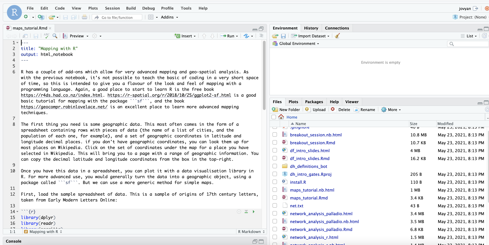
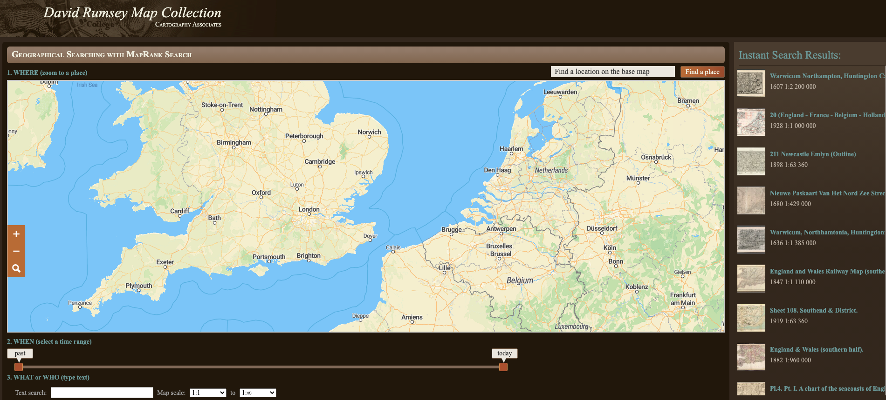
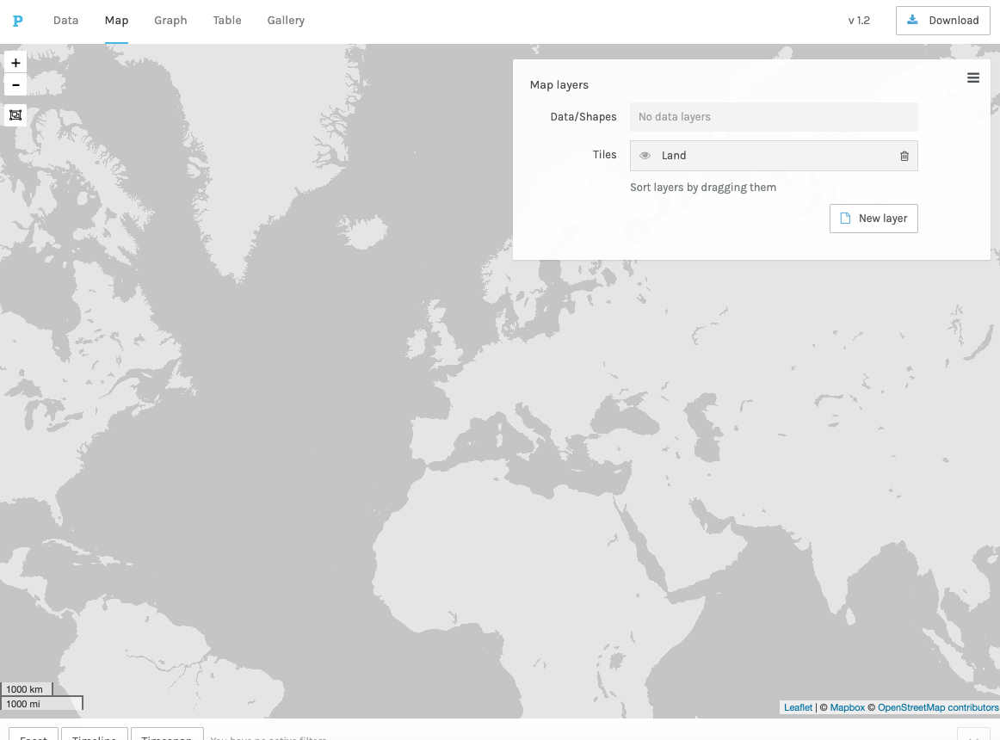
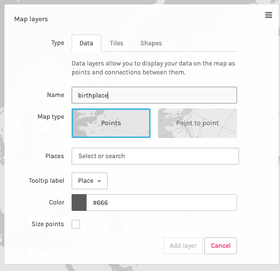
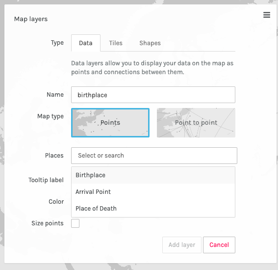

# Mapping

Another very set of digital humanities techniques are related to spatial data. The following are short tutorials to:

1. Find and download historical maps

2. Load and visualise some spatial data with Palladio

3. Try out mapping in a programming language.

The instructions for options 1 and 2 are contained within this page, but to use the interactive notebook, you need to load an interactive environment called MyBinder. 

First, open the following in a new window: https://mybinder.org/v2/gh/yann-ryan/dh_intro_gates/main?urlpath=rstudio

This will starting loading a new Binder instance - an interactive coding environment. it might take a minute or two (so it might be worth going through some of the tutorials below while you're waiting).

Once it has finished, you should see this screen: 

This is called R-Studio: an application designed for writing and running code. We're going to open a pre-made 'notebook'. The bottom-right pane contains a list of files. Look for one called 'maps_tutorial_r.Rmd' and click on it. It will open the notebook on the top-left pane.

## 1 - Find a map on David Rumsey

Spatial Humanities isn't just about creating your own maps, but finding and (eventually) analysing existing, often historical ones. The site https://www.davidrumsey.com/ contains thousands of historical maps which have mostly been 'geo-rectified', meaning that they have been fixed to modern coordinates. This means you can overlay over a modern map to look for changes over time. 

We'll use the 'MapRankSearch' feature to find a map of interest. Open https://rumsey.mapranksearch.com/ in a browser

As you scroll and zoom the map, search results on the right-hand side will reflect the area shown. You can also restrict the map dates using the slider underneath. Once you've found a map, click on it to open it in a picture viewer. Next, click 'View in Georeferencer' to open the map overlaid on a modern one. Use the slider at the top-right of this screen to turn the transparency of the old map up or down, revealing the modern map beneath.

To go even further, you can compare multiple maps at once. CLick the 'overlay and compare' button in the bottom-right corner, which will open the map in Georeferencer.com: here you can add more maps to the interface and change the transparency of each one.

Continue adding and comparing historical maps, or move on to the next section.

## 2 - Plot some points in Palladio

Many tasks using maps involve visualising some geographic data. To do this we can use a tool called Palladio, which was specifically made to work with humanities data. There are a number of very good tutorials for using Palladio, particularly https://miriamposner.com/blog/getting-started-with-palladio/ but in this short session we'll use the sample data to get a feel for the application.

First, go to http://hdlab.stanford.edu/palladio/ and click 'start'. This is where you can load your own data in .csv format (follow the tutorial above to learn how to structure it), or else click on the 'Try with sample data' link on the left hand side.

The project view of Palladio will load up. The sample data is a small dataset of notable individuals, with their gender and places and dates of birth and death. Let's map all the birthplaces in the dataset. 

Click on the map tab at the top of the screen:

Next, create a 'layer', which will allow us to draw points of data on top of the map. Click 'new layer' and give it a name. 

Next, tell Palladio which data to use to draw points on the map. Click on the 'Places' box which will give a drop-down of all the fields in the data with geographic coordinates. Click on the first one, 'Birthplace'.

Last, we want to size the points by the number of people born in that place. Click on the size points tickbox, which will give you a couple of options for data to use for sizing. Leave it at the default, 'Number of People':

Click 'Add layer' to create the points on your map. You've just created a basic interactive map, congratulations! You can move the map around by clicking and dragging, and hovering over a point will display the relevant data (in this case, the number of people born in that place)

Some other things to try:

Add another layer (place of death) and compare the two. 

Try out the 'point to point' option, using both place of birth and place of death.

