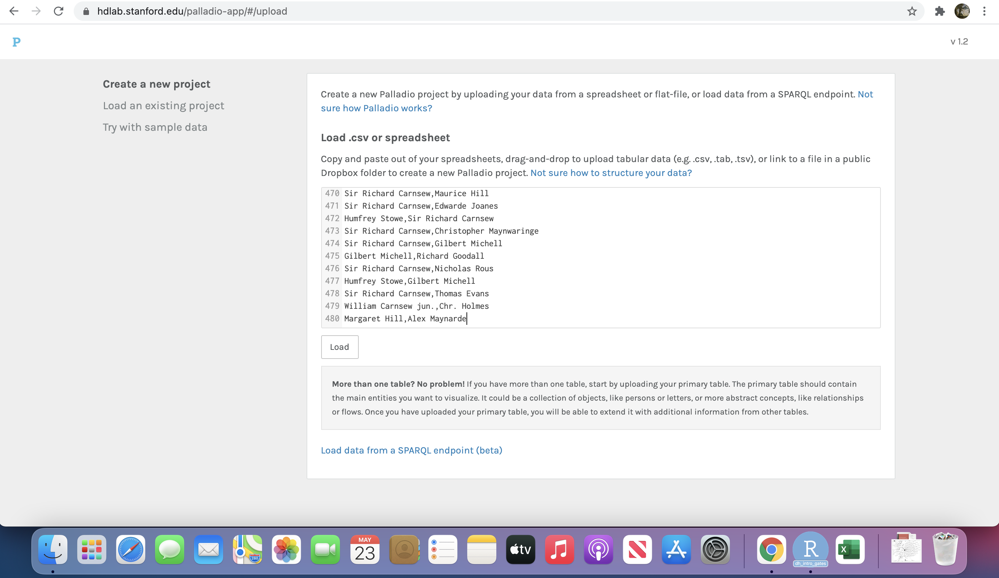

# Introduction

Network analysis, or network science, is a framework for mathematically representing and understanding connections between things. In it, entities (or things), in network-speak known as *nodes*, are connected by what are known as *edges*. When several of these nodes and edges come together we have what is know as a network: this is actually a mathematical object which can then be analysed. We can look, for example, for the most-connected or most central nodes, or to look for separate communities within the network.

There are a number of options for you to work with, from here. The aim is to give you an idea of the  tools that are out there and the kind of data they work with, so don't worry too much about finding interesting results! The options are:

1. Upload some sample network data to Palladio, a free online application which will allow you to make some network visualisations very quickly.

2. Upload the data to a tool called Network Navigator: just as easy to use, this tool gives you a range of network statistics, which can be used to understand the nodes within the network.

3. Try out network analysis in a programming language, using a very simple interactive document. 

## R-Studio and MyBinder (for those with some programming experience)  

The instructions for options 1 and 2 are contained within this page, but to use the interactive notebook, you need to load an interactive environment called MyBinder. If you don't have any coding experience or would prefer to get straight to the data, skip this step and move on to the [first section](#section1).

First, open the following in a new window: https://mybinder.org/v2/gh/yann-ryan/dh_intro_gates/main?urlpath=rstudio

This will starting loading a new Binder instance - an interactive coding environment. it might take a minute or two (so it might be worth going through some of the tutorials below while you're waiting).

Once it has finished, you should see this screen: 

This is called R-Studio: an application designed for writing and running code. We're going to open a pre-made 'notebook'. The bottom-right pane contains a list of files. Look for one called 'network_analysis_r.Rmd' and click on it. It will open the notebook on the top-left pane.

From here, follow the instructions in the notebook text. 

There are a number of other tools which are very useful for doing network analysis, including Gephi, Nodegoat, and the Vistorian. 

# Network visualisation with Palladio  {#section1}

Palladio is a simple web application which allows you to upload your own network data and make some basic network visualisations. 

### Step 1: upload your network data

In order to make a network visualisation with Palladio, it needs a simple piece of data called an *edge list*. This is a spreadsheet listing all the connections between entities in your network. For this tutorial, we'll work with a very small sample of letters. Letters are sent between two people, so in order to create a network, we can represent the people as nodes, and the connection between them, through the action of sending a letter, as the edges. 

An edge list is simply a list of the letters sent and received.

First, go to http://hdlab.stanford.edu/palladio/ in your browser, and click on the 'start' button. You should now have this screen:

The next page will present you with a few options for uploading your data to Palladio. We're going to copy and paste a list of authors and recipients of letters, separated by a comma.

In a second tab, go to https://raw.githubusercontent.com/yann-ryan/dh_intro_gates/main/sample_letter_data_network.csv

You should see a simple text file. Select all the text in the window (click and drag or use control + a or command + a) and copy it to the clipboard. 

Return to the tab with Palladio open and paste the text into the text box under 'Load .csv or spreadsheet', and press the 'load' button underneath.

### Step 2: Create a basic network visualisation

The Palladio app will load with your data. There are a few options here, but we're going to focus on the 'graph'. Click on the 'graph' tab at the top of the screen:

Click on the 'source' drop down, and select the 'author' option in the popup box, and close it:

Do the same for target: click on the 'target' dropdown and select the 'recipient' option in the popup. 

You should now have a basic network visualisation, with the senders and recipients of letters visualised as circles, and the links between them as connecting lines. The algorithm to create the visualisation places highly-connected nodes at the centre, and less-well-connected ones at the periphery. It also groups connected nodes together. 

Try out some the other options, and see if if you can figure out what they are doing to the visualisation.

# Network analysis with Network Navigator

A visualisation like the above is only so useful: it can give you an idea of who is at the centre, and who is at the periphery of a network, but most useful analysis needs some more concrete network 'statistics'. In the next step, we'll load the same dataset into a simple web application designed to produce some useful network statistics, called Network Navigator.

Go to https://network-navigator.library.cmu.edu/ in your browser. 

Open (or return to the tab, if you have it open from the previous step) the sample letter data, https://raw.githubusercontent.com/yann-ryan/dh_intro_gates/main/sample_letter_data_network.csv.

Again, copy and paste this data into the main text box on the Network Navigator main page:

A network can be *directed* or *undirected*. This means it will calculate the metrics in a different way. Select *undirected*. A network can also be *unweighted* or *weighted*. In a weighted network, each link can have an extra measurement, known as its weight. In a letter correspondence network, this weight might be equal to the number of letters sent between two people. Select *unweighted* here.

Press calculate.

After a few seconds you should see some additional information about your network. Directly underneath the text box, you will find a table with all of your nodes (senders and recipients of letters), and a few network statistics in separate columns. You'll also notice a warning that one of the statistics could not be calculated, which you can ignore for now. 

If you click on any of the columns it will sort by that statistic. The two of most interest are the first ones: *degree* is simply the count of that node's incoming connections. While simple, it's a really good indication of the importance of that node to the network as a whole. Nodes with high degree are often known as *hubs*: central points of information through which messages can flow from one side to another. 

The second statistic is known as *betweenness centrality*. This is a slightly more complicated but really useful metric. Betweenness centrality counts the number of times a node is passed if one was to drawn the 'shortest path' between each pair of nodes in the data. Nodes which score highly on this metric are often known as 'bridge' nodes: they might be the connecting links between to separate parts of a network. Particularly interesting are those who score highly here but do not have a high degree. What sort of node might be a bridge despite not having many of their own connections?

To the right, you'll also see two more windows: first, some 'global metrics' which display some statistics on the network as a whole. Underneath this, a basic network visualisation. Which nodes might score highly by betweenness, looking at this diagram?

## Things to think about:

* How might you apply these techniques in your own research?
* What would you need to do to get your data in the form of a network (note that networks are not necessarily between people)?
* What are the pitfalls. Look, particularly, at the list of names and note that some are repeated or ambiguous. How might this affect your network analysis results, and what could you do to fix it?