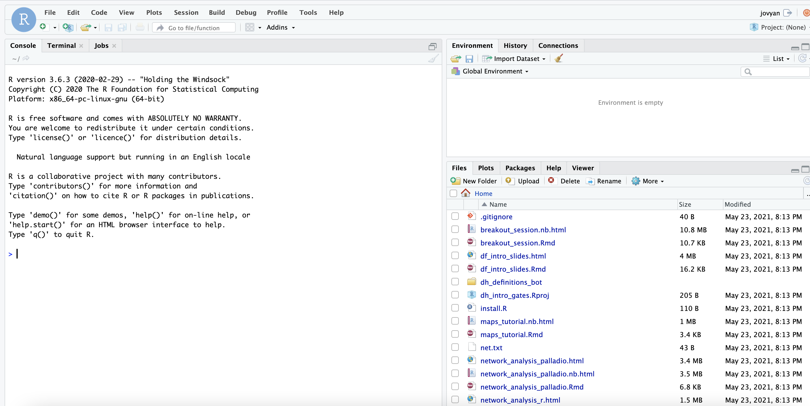
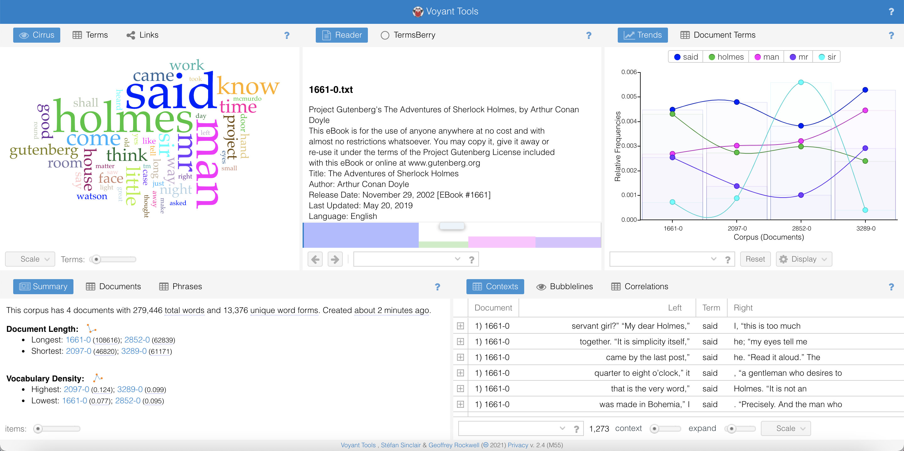

## Introduction

The first technique we're going to try out is text mining. This is the name for a family of tools used to analyse text at scale - rather than reading words we'll use quantitative methods to search for patterns. There are three options to choose from:

1. Use *Voyant-Tools*, a tool with a user-interface, to analyse a pre-existing corpus of documents (or upload your own)
2. Try out *Constellate*, a tool from JSTOR which allows you to create and analyse a custom corpus of journal articles using Python. Constellate contains some very good Python tutorials, but you'll need to work with it after this session to get the most out of it.
3. Try out text mining with the programming language R, using a very short demo interactive document. 

## R-Studio and MyBinder (for those with some programming experience)  

The instructions for options 1 and 2 are contained within this page, but to use the interactive notebook, you need to load an interactive environment called MyBinder. If you don't have any coding experience or would prefer to get straight to the data, skip this step and move on to the [first section](#section1).

First, open the following in a new window: https://mybinder.org/v2/gh/yann-ryan/dh_intro_gates/main?urlpath=rstudio

This will starting loading a new Binder instance - an interactive coding environment. it might take a minute or two (so it might be worth going through some of the tutorials below while you're waiting).

Once it has finished, you should see this screen: 

This is called R-Studio: an application designed for writing and running code. We're going to open a pre-made 'notebook'. The bottom-right pane contains a list of files. Look for one called 'text_mining.Rmd' and click on it. It will open the notebook on the top-left pane.

# Text Analysis with Voyant {#section1}

Voyant-tools.org is a collection of text mining tools with a graphical user interface, meaning you don't need any coding experience to get started. It's a really useful way in to text mining, with a variety of typical text mining tools plus some more experimental ones. 

To start with, you need to select a text to analyse. You can either use pre-loaded texts if you'd just like to get a feel for the application, or you can add your own to analyse.

### Loading a text

The first step is to load the application: open a browser and go to https://voyant-tools.org/. 

#### Load a pre-existing text  

The front page of Voyant allows you to add texts, either one or multiple. It also has a limited selection of texts pre-loaded, so if you would prefer to load one of these and just spend some time playing around with the interface, that is a good place to start. Click 'Open' and choose a corpus containing the entire works of either William Shakespeare or Jane Austen, and click the big 'Reveal' button. If you do this, you can skip straight to the 'Voyant Interface' section below, if you like.

#### Loading your own text

There are two ways to load your own text(s): either by entering a url to a document or by uploading a file from your own computer. We'll use plain text files (the type created by notepad or TextEdit), but you can also upload HTML, XML, and various others (see the [help file](https://voyant-tools.org/docs/#!/guide/corpuscreator-section-input-format) for more details).

First we need some books in plain text format. [Project Gutenberg](https://www.gutenberg.org/) is a site containing a large database of freely-available ebooks, in a variety of formats. Let's make a corpus containing the four Sherlock Holmes novels. 

First, open a new tab in your browser, and find the book you'd like to add on the site, using the search or browse function. The book page will allow you to download the eBook in a number of formats. Once you've found a book of interest, right click on the 'Plain Text UTF-8' link, and click 'copy the link address' (in Chrome):

Return to the Voyant-tools tab, and paste the link into the input box. Switch back to Project Gutenberg and find the other three novels and repeat the process. Copy over the links and put one on each line:

Click 'Reveal' to load the texts in Voyant.

If you're not interested in literature, or if you have a set of documents from your own research you'd like to analyse, you can add text from any URL, or from your computer. There are many sources of text files available, although in many cases, you'll have to first download and unzip a set of files before uploading them. 

Some to try include (however many of these are large files or require some additional steps, and might be best to try offline after the workshop):

*   [The Oxford Text Archive](https://ota.bodleian.ox.ac.uk/)

*   Follow the instructions here: https://glam-workbench.net/trove-harvester/ to bulk download text files from Australian historical newspapers.

*   The Enron corpus (https://www.cs.cmu.edu/~enron/) if you are interested in more recent text for analysis.

### Voyant Interface  

Whether you loaded a pre-existing text, or added your own, you should now be presented with the following screen:

There's a lot going on here at first, so I'll break it down. The screen is divided into five separate panes: three at the top and two underneath, displaying a range of standard text mining tools. Voyant has many more tools available, and you can swap out the default ones for others. If you hover over the top-right of a pane, you'll see three new options. If you click on the windows icon (second from the left), you can select a new tool to replace the current one. You can do this for any of the windows. 

The default tools are, clockwise from the top-left: 

* A word cloud (and list of top terms). A word cloud displays the most frequent words in a corpus, sized by the number of occurences. It's a good way to get an overview of a particular text.
* A reader with the full texts. 
* A trends tool, displaying the frequency of either the five most-common words or a selected word.
* A 'collocation' tool (displays a set number of words either side of a selected word)
* A summary of the corpus. 

Some of the windows have additional pages. Click on 'terms' in the word-cloud (top-left) and instead of a wordcloud you'll get a count of the occurences of the top terms. 

The windows are connected to each other: for example, if you click on a word in the word cloud in the top-left window, you'll see the frequency of that word in the trends pane on the right. 

One typical text mining question is to use what's known as the 'type-token ratio' to compare the writing style of a set of documents. It's the total number of *unique* words (known as types) divided  by the total number of words (tokens). The ratio of the two can be interpreted as the 'richness' of the vocabulary in a particular text.  

To see this, click on the documents tab in the summary window (bottom-left by default)

We can see that there is some difference between the Sherlock Holmes novels (though we need to be careful with the interpretation: longer novels will naturally have a smaller ratio: it would be surprising if an author's use of unique words continued to increase as they wrote longer novels. The two final novels are a very similar length and most easily comparable, and they have very similar ratios).

Spend some more time trying out Voyant tools. Swap out the default windows for some other ones, and note any interesting observations. Think about:

* What sort of questions might this help you answer in your own research?
* What are the advantages and possible pitfalls with this kind of approach?
* What would you need to get your own data in a format where it could be analysed by Voyant?

# Text analysis with Constellate and Python

Constellate is a currently free service run by the Journal database JSTOR. It allows you to build and analyse a corpus of JStor articles, using search terms and other parameters. They take some time to initialise, so for now it's best to use an existing one. 

First, go to https://constellate.org/ and click on 'dashboard' on the top-right. You have the option of building a new dataset or selecting a featured dataset. 

For now, try out one of the featured datasets. Choose one of the featured datasets below, and click on 'analyze'. You'll see a pop-up window with a variety of options. 

These are links to interactive documents containing text and Python code. If you have no experience with Python or Jupyter notebooks, I recommend starting with the first tutorial. Right now, you'll only have time to get a feel for coding and the Jupyter notebook environment, so I recommend making a note to return to this later, if you're interested. 

If you'd like to continue this work afterwards, try out the dataset builder. Have a think about: what sort of questions might you be able to ask with a large dataset of journal article text?

